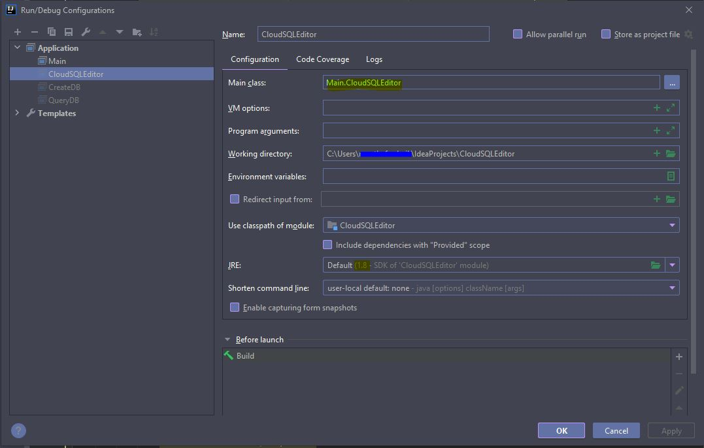
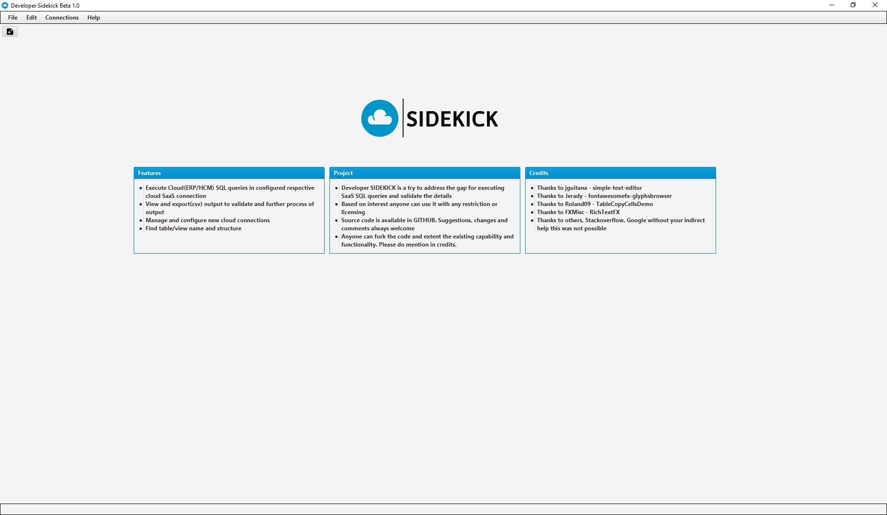
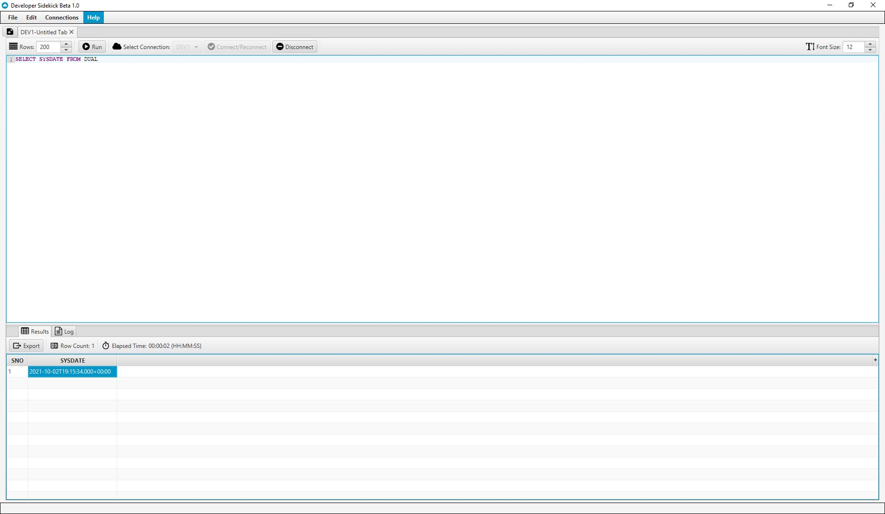

# SIDEKICK

Developer's **SIDEKICK**: An intermediate SQL IDE platform for executing SQL queries in SaaS.

**How to run Source Code**
1. Clone the source code
2. Open in code in Intelij IDE
3. Run the code by default configuration.

**System Requirement:**
1. JDK Version 1.8 or above
2. Window OS

**How to run exe file**
1. Download exe file from releases - [Download Executable](https://github.com/shaikficus/CloudSQLEditor/releases/tag/v1.0.0.1-beta1.0)
2. Create a folder and add exe file.
3. Make sure JAVA_PATH - JDK and PATH - JDK/bin is set

**Screen shot of SIDEKICK**

Welcom Page:

Editor Page:
